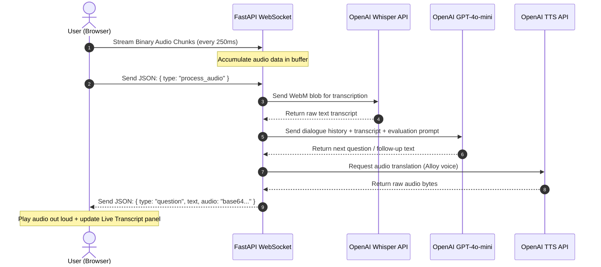

# AI Mock Interviewer

A high-fidelity, real-time AI Mock Interviewer web application that conducts technical and behavioral interviews using voice and text, provides live transcripts, and generates dynamic multi-metric feedback reports.

---

## 🏗️ Real-Time Audio & Dialogue Pipeline

Below is the visual lifecycle of a single voice-based interview turn:



---

## 🛠️ Tech Stack & Key Features

- **Frontend:** React, Vite, TailwindCSS, Web Audio API (`MediaRecorder`), and Web Speech APIs.
- **Backend:** FastAPI, Python, WebSockets.
- **AI Integrations:**
  - **Speech-to-Text (STT):** OpenAI Whisper API with client-side Web Speech `webkitSpeechRecognition` fallback.
  - **Text-to-Speech (TTS):** OpenAI TTS API (Alloy voice) with client-side Web SpeechSynthesis fallback.
  - **Orchestrator (LLM):** GPT-4o-mini with custom prompts for React, ML, Backend, and HR/Behavioral paths.
- **Local Persistence:** LocalStorage logs candidate performance history (scores, summary, and action items) for progress tracking.
- **Robust Fallback Mode:** Works completely offline or without an OpenAI key using browser native voice synthesizers and transcribers.

---

## 🚀 Local Quickstart

### 1. Backend Setup (FastAPI)

1. Navigate to the backend folder:
   ```bash
   cd backend
   ```
2. Create and activate a Python virtual environment:
   ```bash
   python -m venv venv
   # Windows:
   .\venv\Scripts\activate
   # macOS/Linux:
   source venv/bin/activate
   ```
3. Install dependencies:
   ```bash
   pip install -r requirements.txt
   ```
4. Configure environment variables in `.env` (optional):
   ```env
   OPENAI_API_KEY=your-openai-api-key
   ```
   *If left blank, the application automatically uses browser-based speech synthesis and recognition fallbacks.*
5. Launch the server:
   ```bash
   python -m uvicorn main:app --reload --port 8000
   ```
   *API will run at `http://localhost:8000`*

### 2. Frontend Setup (React)

1. Navigate to the frontend folder:
   ```bash
   cd ../frontend
   ```
2. Install Node packages:
   ```bash
   npm install
   ```
3. Launch the development server:
   ```bash
   npm run dev
   ```
   *App will run at `http://localhost:5173`*

---

## 🚀 Deployment Instructions

### Frontend (Deploy to Vercel)
Vercel is ideal for hosting static assets and React apps.

1. Install Vercel CLI globally (if not already installed):
   ```bash
   npm install -g vercel
   ```
2. Run deployment from the `frontend` directory:
   ```bash
   cd frontend
   vercel --prod
   ```
   *Follow the interactive prompts to link and deploy the project. Ensure you set the WebSocket URL in the frontend configuration if you deploy to a production backend.*

### Backend (Deploy to Fly.io)
FastAPI WebSockets require a persistent container backend. Fly.io is optimized for WebSocket traffic.

1. Install Fly CLI:
   - **Windows (PowerShell):** `iwr https://fly.io/install.ps1 -useb | iex`
   - **macOS/Linux:** `curl -L https://fly.io/install.sh | sh`
2. Authenticate:
   ```bash
   fly auth login
   ```
3. Initialize app configuration in the `backend` directory:
   ```bash
   cd backend
   fly launch
   ```
   *Choose a name and region. Do not set up databases when prompted.*
4. Set the OpenAI API Key secret:
   ```bash
   fly secrets set OPENAI_API_KEY=your_actual_openai_key
   ```
5. Deploy:
   ```bash
   fly deploy
   ```

---

## 📢 LinkedIn Announcement Post

Here is a release post ready for your network:

```text
🚀 I just built and deployed Interviewer.AI - a real-time AI Mock Interviewer! 

Interview prep is often passive, but practice needs to be active. I wanted to build an app that behaves like a real human panel: asking deep questions, actively listening, and asking logical follow-ups.

Here is how it works under the hood:
1️⃣ Captures microphone streams using the Web Audio API and streams binary chunks over WebSockets.
2️⃣ FastAPI processes the stream and transcribes speech using OpenAI Whisper.
3️⃣ GPT-4o-mini acts as the interviewer (React Dev, ML, Backend, or HR presets), analyzing answers in context to ask follow-up questions.
4️⃣ OpenAI TTS streams the audio response back to the client for vocal output.
5️⃣ Runs fallback SpeechSynthesis / webkitSpeechRecognition client-side if API keys are missing.
6️⃣ Generates a detailed analytics card scoring Technical Depth, Clarity, and Confidence, highlighting 3 actionable areas for improvement.

Check out the repo here to try it locally or launch your own! 💻👇
#AI #WebSockets #FastAPI #ReactJS #OpenAI #SpeechRecognition #WebSpeechAPI
```
